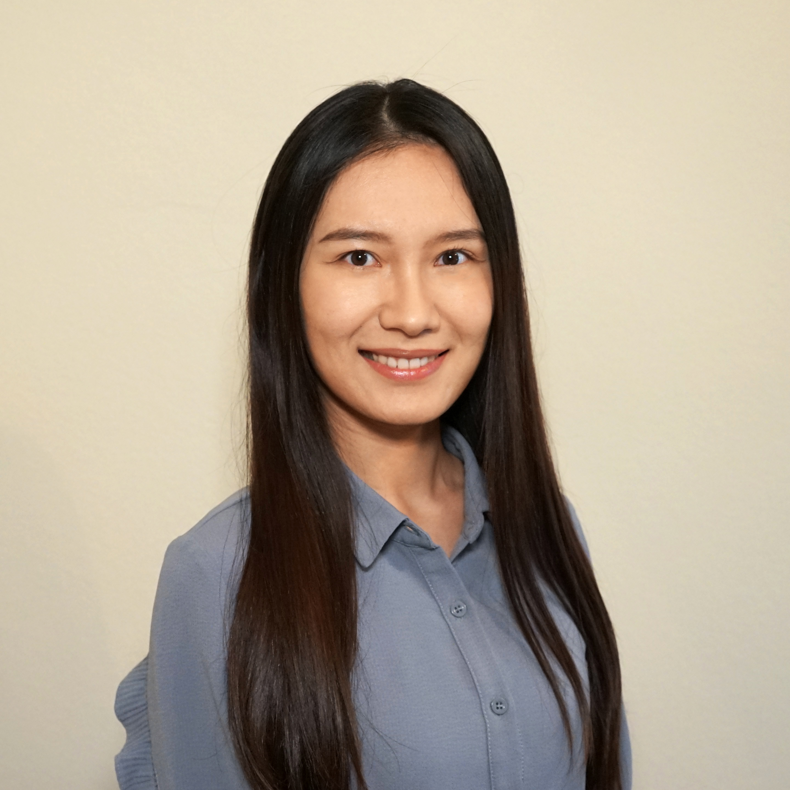

Aside
================================================================================

{width=40%}

Contact Info {#contact}
--------------------------------------------------------------------------------

- <i class="fa fa-envelope"></i> lzhao724@gmail.com
- <i class="fa fa-phone"></i> +1 (402) 318-9916
- For more information, please contact me via email.

Skills {#skills}
--------------------------------------------------------------------------------

- Statistical Analysis

- Programming: Python, MATLAB, R, SAS, Java

- Technical Communication and Consulting

Main
================================================================================

Lin Zhao {#title}
--------------------------------------------------------------------------------

Education {data-icon=graduation-cap data-concise=true}
--------------------------------------------------------------------------------
### Georgia Institute of Technology

MASTER OF SCIENCE IN COMPUTER SCIENCE

Atlanta, Georgia

2019 - present

GPA:4.0/4.0

### University of Nebraska-Lincoln

MASTER OF SCIENCE IN STATISTICS

Lincoln, Nebraska

2019 - present

GPA:3.961/4.0

### Harbin Institute of Technology

MASTER OF ENGINEERING IN MATERIALS ENGINEERING

Shenzhen, China

2016 - 2018

GPA: 3.52/4.0 
Ranking:1/66

### Liaoning Technical University

B.S. in Materials forming and controlling engineering

Fuxin, China

2011 - 2015

GPA: 3.215/4.0 
Ranking:2/118

Research Experience {data-icon=laptop}
--------------------------------------------------------------------------------

### Graduate Research Assistant

University of Nebraska-Lincoln

Lincoln, Nebraska

2020 - present

- Built a model to predict stomatal conductance based on leaf temperature and weather data
- Performed image registration on thermal image and RGB image to match the green pixels with corresponding temperature information.

Projects {data-icon=suitcase}
--------------------------------------------------------------------------------

### Constructing an AI agent to address a human intelligence test

College of computing

Georgia Tech

May.2020-Jul.2020

- Course: Knowledge based AI
- Top 3 performer in 400 students. 
- Implemented an AI agent to solve Raven’s Progressive Matrices using Python

### Word find game app

College of computing

Georgia Tech

Feb.2020

- Developed an Android app that implements a word game with user interface
- Experienced with the Unified Software Process
- Communicated with three other group members to effectively collaborated on the project

### Improve user interface (UI) design of Apple Music

College of computing

Georgia Tech

Nov.2019

- Performed heuristic evaluation on Apple Music mobile app.
- Redesign the user interface of Apple Music and justified the better performance on the new design
- Awarded exemplary project in class

### Spatial analysis on the effect of environmental factors

Department of Statistics

UNL

Apr.2020

- Developed a model to describe the effect of environment factors on phenotyping of plants
- Evaluated both non-spatial linear regression model and bayesian spatial modeling to find the best fit

Honors and awards {data-icon=chalkboard-teacher}
--------------------------------------------------------------------------------

### Outstanding Graduates of Harbin Institute of Technology(2018)

N/A

N/A

N/A

### National Scholarship for Graduate student(2017)

N/A

N/A

N/A

### The First Prize Scholarship of Harbin Institute of Technology(2017)

N/A

N/A

N/A

### Outstanding Volunteer in Shenzhen Nanshan Half Marathon(2016)

N/A

N/A

N/A

Selected Publications and Posters {data-icon=file}
--------------------------------------------------------------------------------

### Applications of Rare Earth Elements in Electroplating 

Electroplating & Pollution Control. 2012 Jan 15;129(10):2075-84.

N/A

2012 

**Zhao L**, Sun K, Zhang Y.
